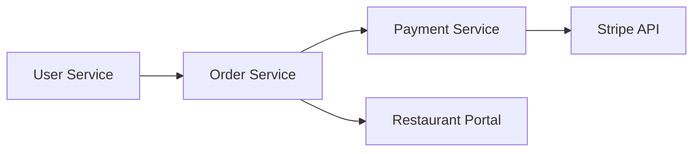
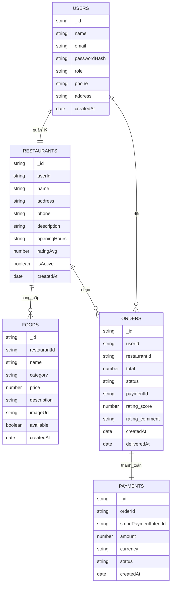
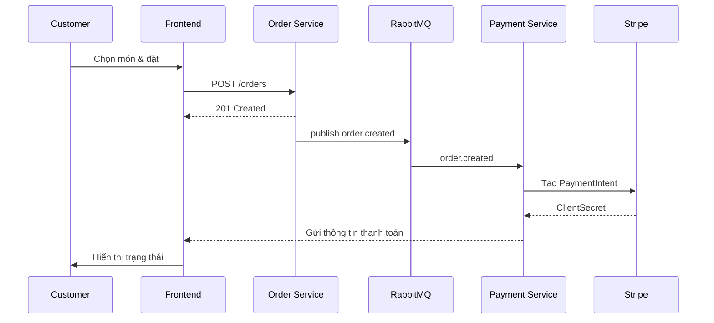
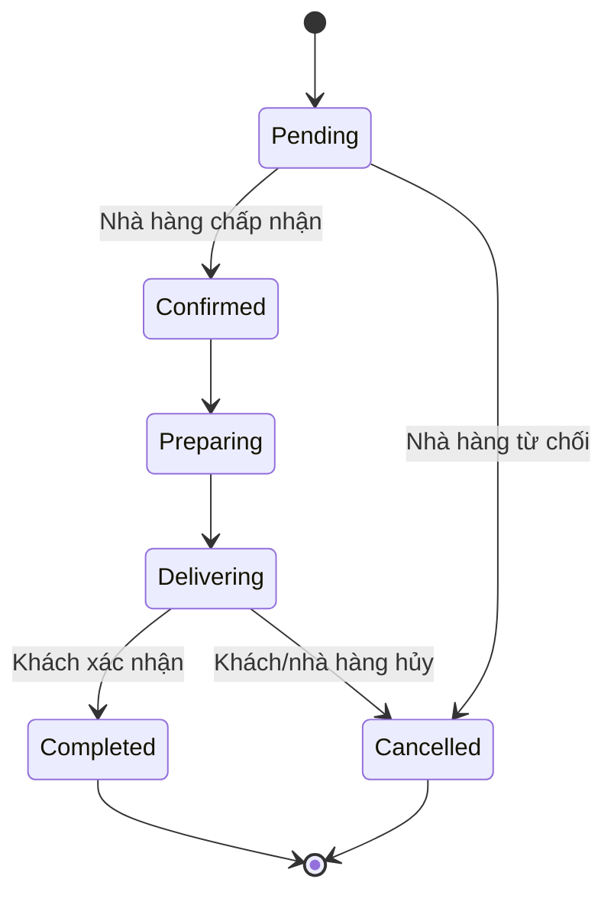
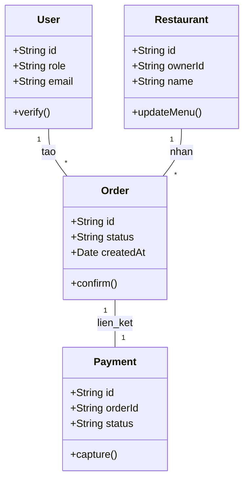
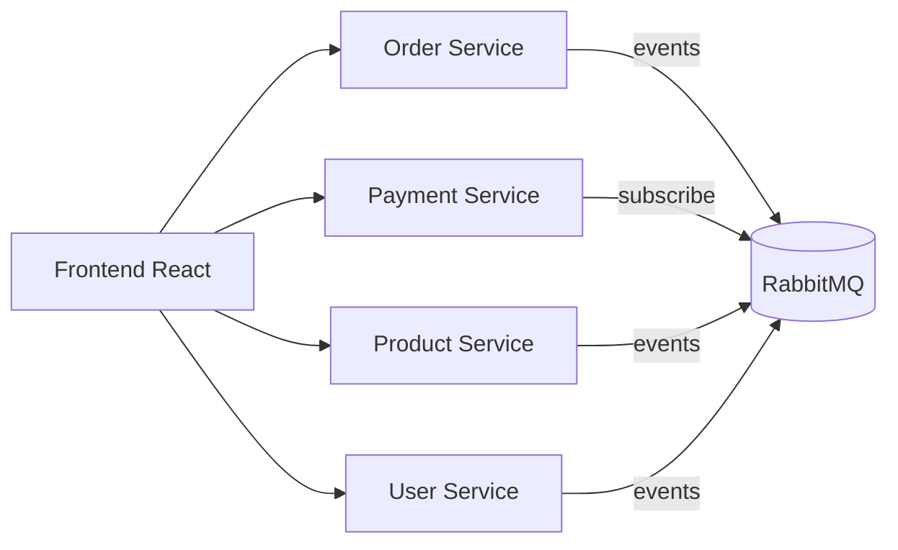
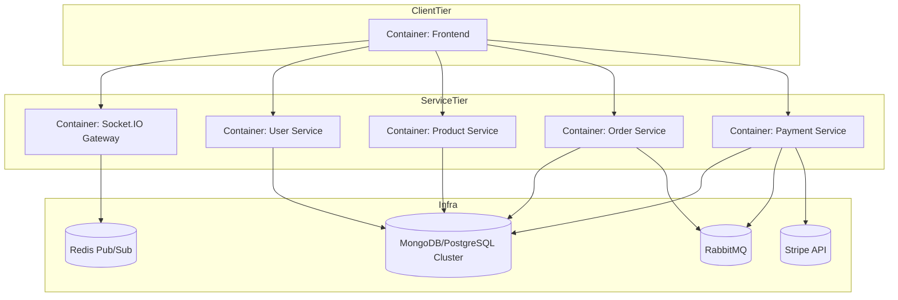
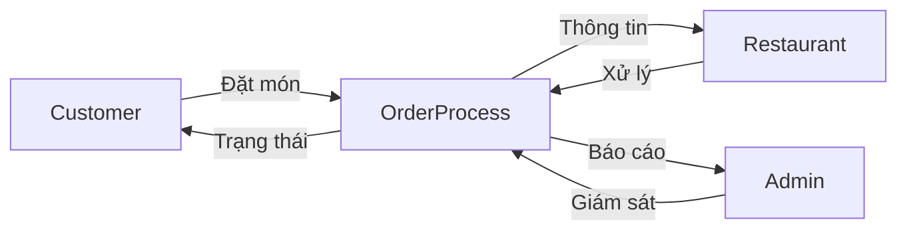
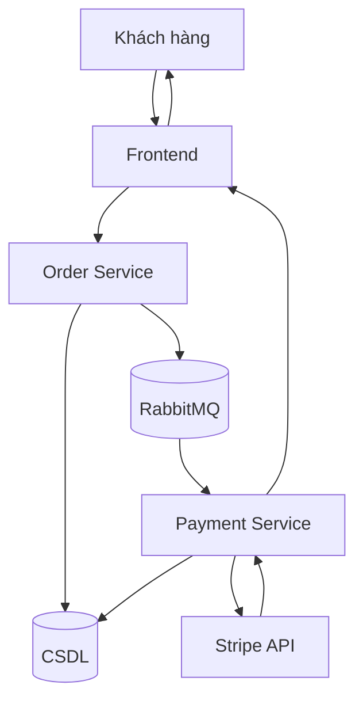

# Food Delivery System Documentation (Vietnamese)

> **Tóm tắt:**  
> Tài liệu này trình bày quá trình phân tích và thiết kế hệ thống giao đồ ăn **SkyDish**, phát triển theo kiến trúc **microservices Node.js**.  
> Nội dung bao gồm mô hình yêu cầu sản phẩm, thiết kế backend, cơ sở dữ liệu, sơ đồ UML, DFD, và kịch bản kiểm thử.  
> Tài liệu hướng đến việc minh chứng quy trình kỹ nghệ phần mềm hiện đại, nhấn mạnh các yếu tố hiệu năng, khả năng mở rộng và tính nhất quán dữ liệu trong môi trường phân tán.

## Mục lục
- [1. Tài liệu yêu cầu sản phẩm (PRD)](#1-tài-liệu-yêu-cầu-sản-phẩm-prd--product-requirements-document)
- [2. Trường hợp sử dụng trọng tâm](#2-trường-hợp-sử-dụng-trọng-tâm)
- [3. Thiết kế Backend](#3-thiết-kế-backend)
- [4. Thiết kế cơ sở dữ liệu](#4-thiết-kế-cơ-sở-dữ-liệu)
- [5. Các sơ đồ hệ thống (UML + DFD)](#5-các-sơ-đồ-hệ-thống-uml--dfd)
- [6. Kịch bản kiểm thử](#6-kịch-bản-kiểm-thử)
- [7. Tài liệu tham khảo](#7-tài-liệu-tham-khảo)

## 1. Tài liệu yêu cầu sản phẩm (PRD – Product Requirements Document)

### 1.1 Giới thiệu tổng quan
Hệ thống SkyDish được thiết kế nhằm bảo đảm chuỗi giá trị giao đồ ăn hoạt động thông suốt từ lúc khách hàng tìm kiếm món ăn đến khi đơn hàng được xác nhận hoàn tất. Theo mô hình microservices, mỗi thành phần (Auth, Restaurant, Order, Delivery, Payment, Realtime Gateway, Frontend) chịu trách nhiệm riêng biệt và giao tiếp qua REST API kết hợp cổng sự kiện realtime, cho phép triển khai linh hoạt trên Docker Compose và dễ dàng mở rộng trong tương lai.

### 1.2 Vấn đề cần giải quyết
Thị trường giao đồ ăn nội đô thường gặp ba vấn đề chính: dữ liệu nhà hàng cập nhật chậm, trạng thái đơn hàng thiếu minh bạch và giai đoạn hậu giao chưa có cơ chế xác nhận đáng tin cậy. Đề tài “Online Food Ordering System” được lựa chọn để giải quyết các vấn đề trên bằng cách xây dựng một kiến trúc microservices có khả năng đồng bộ dữ liệu theo thời gian thực và bổ sung các điểm kiểm soát chất lượng sau giao. Mục tiêu kỹ thuật của đồ án là minh họa trọn vẹn vòng đời kỹ nghệ phần mềm (phân tích, thiết kế, kiểm thử) theo chuẩn IEEE, đồng thời cung cấp bằng chứng thực nghiệm cho học phần Công nghệ Phần mềm tại Đại học Sài Gòn.

### 1.3 Chân dung người dùng
- **Khách hàng:** mong muốn quy trình đặt món nhanh, thanh toán an toàn và theo dõi trạng thái realtime. Do đó, giao diện cần hỗ trợ đăng nhập đơn giản, giỏ hàng linh hoạt và tính năng xác nhận nhận hàng để giảm tranh chấp.  
- **Nhà hàng:** cần dashboard trực quan để quản lý hồ sơ, menu, tồn kho và đơn đến. Việc cung cấp API bật/tắt hoạt động cùng thông báo realtime giúp nhà hàng tối ưu vận hành nội bộ.  
- **Quản trị viên (Super Admin/Ops):** chịu trách nhiệm duyệt nhà hàng, giám sát tài xế, kiểm soát doanh thu. Hệ thống phải cung cấp góc nhìn tập trung và khả năng khóa tài khoản khi phát hiện rủi ro.

### 1.4 Mục tiêu hệ thống và phạm vi
Hệ thống hướng đến các mục tiêu: (1) xử lý ≥99% yêu cầu đặt món thành công trong vòng 5 giây khi tải ≤500 người dùng đồng thời; (2) hoàn tất quy trình duyệt nhà hàng/tài xế trong <24 giờ; (3) đồng bộ trạng thái đơn giữa giao diện khách và nhà hàng với độ trễ <5 giây thông qua RabbitMQ/Socket.IO; (4) tích hợp Stripe để đảm bảo kiểm soát dòng tiền. Phạm vi phiên bản hiện tại bao trùm dịch vụ Người dùng, Sản phẩm, Đơn hàng, Thanh toán và cổng realtime.

### 1.5 Các tính năng chính
Hệ thống cung cấp các năng lực cốt lõi: quản lý tài khoản đa vai trò bằng JWT, onboarding nhà hàng và menu, quy trình đặt món – thanh toán – hậu giao, phát sự kiện realtime, và dashboard quản trị phục vụ giám sát, báo cáo. Những tính năng này giúp tối ưu chuỗi vận hành và tạo sự minh bạch cho tất cả các bên tham gia.

### 1.6 Bảng yêu cầu chức năng
| ID | Tên chức năng | Mô tả | Độ ưu tiên |
|----|---------------|-------|-----------|
| FR-01 | Quản lý người dùng đa vai trò | Đăng ký, xác thực và quản lý hồ sơ Khách hàng, Nhà hàng, Quản trị viên bằng JWT | Cao |
| FR-02 | Quản trị nhà hàng & menu | Cho phép nhà hàng nộp hồ sơ, cập nhật thông tin, CRUD món ăn kèm media và bật/tắt trạng thái phục vụ | Cao |
| FR-03 | Quy trình đặt món | Khách hàng tìm kiếm, thêm món vào giỏ, đặt đơn và nhận thông báo realtime | Cao |
| FR-04 | Xử lý đơn hàng nhà hàng | Nhà hàng nhận thông báo, xác nhận, chuẩn bị và bàn giao đơn thông qua dashboard | Cao |
| FR-05 | Thanh toán Stripe | Tạo Payment Intent, nhận webhook, lưu vết đối soát và phát hành hóa đơn | Cao |
| FR-06 | Hậu giao & đánh giá | Khách hàng xác nhận nhận món, gửi đánh giá; dữ liệu được chuyển tới Restaurant/Admin | Trung bình |
| FR-07 | Quản trị tập trung | Admin duyệt/khóa tài khoản, xem thống kê doanh thu, truy cập proxy API liên dịch vụ | Trung bình |
| FR-08 | Thông báo realtime | Phát sự kiện trạng thái đơn qua Socket.IO/RabbitMQ tới từng đối tượng liên quan | Cao |

### 1.7 Yêu cầu phi chức năng
| Nhóm | Mô tả | Chỉ tiêu |
|------|-------|----------|
| Hiệu năng | API REST phản hồi <300ms (p95) ở tải 500 RPS; hàng đợi xử lý thông điệp <2 giây | p95 latency ≤300ms |
| Bảo mật | 100% endpoint quan trọng yêu cầu JWT/service key; giao tiếp mã hóa TLS; tuân thủ PCI DSS | Đảm bảo bảo mật đầu-cuối |
| Khả năng mở rộng | Microservices có thể scale ngang qua Docker/Kubernetes; RabbitMQ hỗ trợ fan-out sự kiện | Scale tuyến tính khi nhân bản |
| Sẵn sàng | Uptime ≥99.5%/tháng, không mất dữ liệu khi một instance lỗi nhờ replica Mongo/PostgreSQL | Downtime <3.6h/tháng |
| Quan sát | Log tập trung và tracing liên dịch vụ, cảnh báo khi tỷ lệ lỗi thanh toán >0.5% | Tích hợp ELK/Prometheus |

### 1.8 Kịch bản sử dụng tiêu biểu
- **Khách hàng:** đăng nhập → duyệt menu → đặt món → thanh toán → theo dõi trạng thái → xác nhận nhận hàng → đánh giá. Chuỗi này thể hiện trải nghiệm người dùng đầu cuối mà hệ thống phải bảo đảm độ trễ thấp và phản hồi tức thì.  
- **Nhà hàng:** tiếp nhận thông báo đơn mới → kiểm tra nguyên liệu → xác nhận → cập nhật “đang chuẩn bị” → bàn giao. Việc cập nhật realtime giúp hạn chế sai sót trong bếp.  
- **Quản trị viên:** xem danh sách yêu cầu duyệt → đánh giá tuân thủ → phê duyệt/khóa → theo dõi doanh thu ngày → đối soát thanh toán. Quy trình này bảo chứng cho tính minh bạch của marketplace.

## 2. Trường hợp sử dụng trọng tâm

### UC-Confirm-Delivery – Khách hàng xác nhận đã nhận món (loại bỏ shipper)
- **Mô tả:** Use case này mô tả nghiệp vụ khi khách hàng tự xác nhận đã nhận đầy đủ món hàng, bỏ qua bước tài xế nội bộ. Việc xác nhận này kích hoạt chuỗi cập nhật trạng thái, capture thanh toán và ghi nhận đánh giá hậu giao.  
- **Tác nhân:** Khách hàng (chính), Order Service, Payment Service, Admin Dashboard.  
- **Tiền điều kiện:** Đơn đang ở trạng thái `Delivering`, khoản thanh toán đã `authorized`, khách hàng đăng nhập hợp lệ.  
- **Hậu điều kiện:** Đơn chuyển sang `Completed`, khoản tiền được capture, bản ghi đánh giá (nếu có) được khởi tạo, thông báo gửi tới nhà hàng và admin.

**Luồng chính:**  
1. Khách hàng mở trang chi tiết đơn và chọn “Xác nhận đã nhận món”.  
2. Frontend gửi `PATCH /api/orders/:id/confirm` tới Order Service.  
3. Order Service kiểm tra trạng thái, ghi Outbox và phát sự kiện `order.completed` lên RabbitMQ.  
4. Payment Service nhận sự kiện, thực hiện capture qua Stripe và cập nhật bảng `payments`.  
5. Order Service đánh dấu `deliveredAt`, chuyển trạng thái `Completed`, ghi log đánh giá mặc định và phản hồi thành công.  
6. Gateway realtime đẩy thông báo tới khách hàng, nhà hàng và admin.

**Luồng thay thế:**  
- 2a. Nếu đơn đã hoàn tất, hệ thống trả thông báo “Đơn đã được xác nhận trước đó”.  
- 4a. Nếu capture Stripe tạm lỗi, Payment Service đặt trạng thái `pending_capture` và lên lịch retry; khách vẫn nhận thông báo đã xác nhận nhưng admin nhận cảnh báo.

**Ngoại lệ:**  
- E1: Người dùng không sở hữu đơn → trả mã lỗi 403.  
- E2: RabbitMQ không khả dụng → sự kiện được lưu trong Outbox chờ worker xử lý; người dùng nhận thông báo “đang xử lý”.  
- E3: Stripe lỗi vĩnh viễn → đơn gắn nhãn “Completed (payment_failed)” và admin phải can thiệp thủ công.

## 3. Thiết kế Backend

### 3.1 Phân hệ tổng thể
Kiến trúc backend gồm ba phân hệ chức năng:
- **Client Subsystem:** bao gồm frontend React và lớp API Gateway mỏng, đảm nhận xác thực JWT, điều phối yêu cầu tới User, Product và Order Service. Cấu trúc này giúp tách biệt logic trình bày khỏi nghiệp vụ cốt lõi.  
- **Restaurant Subsystem:** tập trung vào portal quản lý nhà hàng, đồng bộ menu/tồn kho và nhận webhook cập nhật đơn. Điều này cho phép nhà hàng chủ động xử lý đơn mà không ảnh hưởng đến khách hàng khác.  
- **Admin Subsystem:** cung cấp dashboard giám sát, kết nối tới các API quản trị của User/Order/Payment Service và subscribe RabbitMQ để nhận cảnh báo realtime. Phân hệ này đảm bảo quyền kiểm soát tập trung nhưng vẫn giữ nguyên tính độc lập của từng dịch vụ.

### 3.2 Microservices chính
- **User Service:** xử lý đăng ký, đăng nhập, phân quyền và trạng thái duyệt. Việc tách riêng service giúp đơn giản hóa chính sách bảo mật và cho phép mở rộng sang OAuth trong tương lai.  
- **Product Service:** quản trị nhà hàng, chi nhánh, món ăn và media. Dịch vụ này chịu trách nhiệm đảm bảo dữ liệu menu nhất quán với trạng thái kinh doanh, đồng thời phát sự kiện khi menu thay đổi để đồng bộ cache.  
- **Order Service:** điều phối quy trình đặt món, duy trì state machine của đơn và áp dụng mẫu Outbox để đảm bảo thông điệp được gửi an toàn sang RabbitMQ.  
- **Payment Service:** tương tác Stripe để tạo Payment Intent, xử lý webhook và capture khi đơn hoàn tất. Dịch vụ cũng gửi email/SMS nhằm gia tăng khả năng truy nguyên.


Sơ đồ trên mô tả cách User Service cung cấp danh tính, Order Service điều phối nghiệp vụ trung tâm, Payment Service giao tiếp Stripe để chốt giao dịch, và Restaurant Portal nhận tín hiệu trực tiếp nhằm cập nhật tiến độ phục vụ.

### 3.3 Giao tiếp giữa các service
- **REST API:** Frontend gọi trực tiếp từng service qua ingress tương ứng. Cách tiếp cận này giữ cho hợp đồng API rõ ràng và dễ kiểm thử.
- **RabbitMQ:** được chọn thay vì Kafka để ưu tiên độ trễ thấp, cấu hình đơn giản và sự phù hợp với môi trường container hóa. Các sự kiện `order.created`, `order.completed`, `payment.failed` bảo đảm các service đồng bộ eventual mà vẫn độc lập triển khai.
- **Realtime (Socket.IO):** Gateway nhận sự kiện nội bộ (qua một REST endpoint có ký tên) rồi phát tới client theo từng room. Redis Pub/Sub giúp gateway scale ngang mà vẫn duy trì phiên kết nối.

### 3.4 Công nghệ và môi trường triển khai
Hệ thống sử dụng Node.js 20, Express.js và (tùy dịch vụ) TypeScript để đảm bảo sự thống nhất trong đội ngũ phát triển. Docker Compose hỗ trợ môi trường phát triển đồng nhất; hướng triển khai sản xuất là Kubernetes. MongoDB phục vụ User/Product/Order nhờ tính linh hoạt của document model, trong khi PostgreSQL có thể được dùng cho Payment để tận dụng transaction mạnh hơn. RabbitMQ đảm nhiệm hàng đợi sự kiện, còn Socket.IO + Redis đảm bảo realtime notifications. Tổng thể kiến trúc được thiết kế nhằm cân bằng giữa hiệu năng, khả năng mở rộng và chi phí vận hành.

## 4. Thiết kế cơ sở dữ liệu

### 4.1 Bối cảnh và phân tách dữ liệu
Theo mô hình microservices, mỗi dịch vụ sở hữu schema riêng: User Service giữ Users/Roles/Refresh Tokens; Product Service quản lý Restaurants/Branches/Products; Order Service duy trì Orders/OrderItems/DeliveryInfo/Ratings/Outbox; Payment Service lưu Payments/Payouts/Stripe Logs. Cách phân chia này giảm phụ thuộc lẫn nhau, cho phép tối ưu truy vấn theo từng ngữ cảnh và hỗ trợ chiến lược scale độc lập.

### 4.2 Thực thể chính và lý do thiết kế
- **Users:** lưu thông tin định danh, vai trò và trạng thái duyệt, giúp áp dụng chính sách bảo mật rõ ràng.  
- **Restaurants:** mô tả giấy phép, cấu hình kinh doanh, cần tách riêng để hỗ trợ nhiều chi nhánh.  
- **Orders:** là trung tâm giao dịch, lưu trạng thái, thời điểm và thông tin giao hàng.  
- **Payments:** ánh xạ với Stripe PaymentIntent nhằm đảm bảo truy nguyên tài chính.  
- **Ratings:** cung cấp phản hồi chất lượng, giúp cải thiện thuật toán gợi ý.  
- **Outbox:** bổ sung để bảo đảm tính nhất quán eventual giữa Order và Payment thông qua pattern “transactional outbox”.

### 4.3 ERD (Mermaid)

Sơ đồ thể hiện rõ khóa ngoại `restaurants.userId`, `foods.restaurantId`, `orders.userId`, `orders.restaurantId`, `orders.paymentId` và `payments.orderId`, cùng hai thuộc tính đánh giá (`rating_score`, `rating_comment`) được nhúng trực tiếp trong collection `orders`. Cách mô hình hóa này phản ánh đúng việc hệ thống không tách riêng dịch vụ đánh giá mà gắn liền với từng đơn hàng.

#### Giải thích mối quan hệ và cách lưu trữ
- **USERS – RESTAURANTS (1:1, reference):** Mỗi nhà hàng gắn với duy nhất một tài khoản chủ (`userId`). Quan hệ được lưu dạng reference để tái sử dụng thông tin đăng nhập của bảng `users` và áp dụng phân quyền thống nhất.
- **RESTAURANTS – FOODS (1:N, reference):** Một nhà hàng có thể công bố nhiều món ăn (`restaurantId`). Reference giúp menu mở rộng mà không cần sao chép thông tin nhà hàng vào từng document món.
- **USERS – ORDERS (1:N, reference):** Một khách hàng có thể đặt nhiều đơn (`userId`). Lưu reference để giữ kích thước document `orders` gọn và cho phép join logic ở tầng ứng dụng.
- **RESTAURANTS – ORDERS (1:N, reference):** Mỗi nhà hàng nhận nhiều đơn (`restaurantId`). Reference hỗ trợ truy vấn các đơn theo nhà hàng một cách hiệu quả.
- **ORDERS – PAYMENTS (1:1, reference):** Mỗi đơn tương ứng đúng một giao dịch Stripe (`paymentId`/`orderId`). Reference bảo đảm ngắt kết nối giữa Order Service và Payment Service nhưng vẫn dễ truy dấu khi đối soát.
- **ORDERS – rating (1:1, embed):** Vì mỗi đơn chỉ có tối đa một đánh giá nhỏ, embedding `rating.score/comment` trực tiếp trong `orders` giúp đọc/ghi nhanh và không cần collection riêng, phù hợp với yêu cầu không có Rating Service độc lập.

#### Bảng tổng hợp mapping Mongo Atlas
| Collection | Quan hệ | Kiểu quan hệ | Lưu trữ Mongo | Giải thích |
|------------|---------|--------------|---------------|------------|
| users – restaurants | 1:1 | Reference | `restaurants.userId` trỏ tới `users._id` | Mỗi nhà hàng có một chủ tài khoản, tái sử dụng logic auth |
| restaurants – foods | 1:N | Reference | `foods.restaurantId` trỏ tới `restaurants._id` | Một nhà hàng quản lý nhiều món ăn, thuận tiện lọc menu |
| users – orders | 1:N | Reference | `orders.userId` trỏ tới `users._id` | Một khách hàng có thể đặt nhiều đơn, tránh lặp thông tin |
| restaurants – orders | 1:N | Reference | `orders.restaurantId` trỏ tới `restaurants._id` | Nhà hàng nhận nhiều đơn, hỗ trợ thống kê theo nhà hàng |
| orders – payments | 1:1 | Reference | `payments.orderId` (và `orders.paymentId`) | Mỗi đơn tương ứng một giao dịch Stripe để đối soát |
| orders – rating | 1:1 | Embed | `orders.rating.score/comment` | Đánh giá nhỏ gọn, chỉ tồn tại khi đơn hoàn tất, không cần collection riêng |

## 5. Các sơ đồ hệ thống (UML + DFD)

### 5.1 Sơ đồ Use Case
```mermaid
usecaseDiagram
actor KhachHang as Customer
actor NhaHang as Restaurant
actor Admin
Customer --> (Đặt món ăn)
Customer --> (Theo dõi đơn hàng)
Customer --> (Xác nhận nhận hàng)
Restaurant --> (Xử lý đơn hàng)
Restaurant --> (Cập nhật menu)
Admin --> (Quản lý hệ thống)
```
Sơ đồ Use Case thể hiện biên hệ thống và các chức năng trọng yếu mà từng tác nhân được phép truy cập, qua đó dẫn dắt quá trình phân tích yêu cầu và xác định phạm vi phát triển.

### 5.2 Sơ đồ Hoạt động – Quy trình xác nhận đơn
```mermaid
flowchart TD
    A[Bắt đầu] --> B[Khách mở chi tiết đơn]
    B --> C[Nhấn "Xác nhận nhận món"]
    C --> D[Frontend gửi yêu cầu tới Order Service]
    D --> E[Order Service kiểm tra trạng thái]
    E -->|Hợp lệ| F[Phát sự kiện order.completed]
    F --> G[Payment Service capture tiền]
    G --> H[Cập nhật trạng thái đơn = Completed]
    H --> I[Gửi thông báo realtime]
    I --> J[Kết thúc]
    E -->|Không hợp lệ| X[Trả lỗi và ghi log]
```
Sơ đồ hoạt động mô tả chuỗi bước nghiệp vụ từ giao diện tới backend khi khách xác nhận đơn. Mỗi nút quyết định thể hiện rõ trách nhiệm của Order Service và Payment Service trong việc thẩm định trạng thái và thu tiền.

### 5.3 Sơ đồ Trình tự – Đặt món & thanh toán

Sơ đồ trình tự minh họa luồng giao tiếp giữa các thành phần chính khi khách hàng đặt món. Mọi sự kiện được truyền qua RabbitMQ nhằm đảm bảo tính phi đồng bộ và khả năng chịu lỗi khi các service cần xử lý độc lập.

### 5.4 Sơ đồ Trạng thái – Đơn hàng

Sơ đồ trạng thái mô tả vòng đời của một đơn hàng, cho phép Order Service xây dựng state machine rõ ràng và đưa ra các ràng buộc chuyển trạng thái hợp lệ trước khi cập nhật dữ liệu.

### 5.5 Sơ đồ Lớp

Sơ đồ lớp mô hình hóa các thực thể nghiệp vụ cùng phương thức chính, hỗ trợ đội ngũ phát triển ánh xạ sang schema cơ sở dữ liệu hoặc DTO/Model trong mỗi microservice.

### 5.6 Sơ đồ Thành phần

Sơ đồ thành phần nhấn mạnh cách frontend tương tác với các dịch vụ thông qua REST, trong khi các dịch vụ trao đổi thông tin gián tiếp qua RabbitMQ để đạt được loose coupling và khả năng scale độc lập.

### 5.7 Sơ đồ Triển khai

Sơ đồ triển khai cho thấy từng container (frontend, service, gateway) được bố trí tách biệt và liên kết tới hạ tầng (DB, RabbitMQ, Redis, Stripe). Cách bố trí này giúp kiểm soát tài nguyên và chuẩn bị sẵn sàng cho việc triển khai trên Kubernetes.

### 5.8 Sơ đồ DFD
#### Level 0

DFD Level 0 mô tả luồng thông tin tổng thể giữa ba tác nhân chính và tiến trình xử lý đơn. Hình ảnh này nhấn mạnh rằng OrderProcess là điểm hội tụ chia sẻ dữ liệu cho tất cả bên liên quan.

#### Level 1 – Quy trình đặt món & thanh toán

DFD Level 1 đi sâu vào bước đặt món: Frontend gửi dữ liệu tới Order Service, Order Service ghi CSDL và phát sự kiện sang RabbitMQ, Payment Service tương tác Stripe rồi cập nhật lại cơ sở dữ liệu và thông báo khách hàng. Điều này bảo đảm dòng dữ liệu liền mạch và có khả năng phục hồi nếu một thành phần tạm ngưng hoạt động.

## 6. Kịch bản kiểm thử

### 6.1 Scenario 1 – Khách hàng đặt món và xác nhận đơn
- **Bước kiểm thử:** Đăng nhập → chọn món → gửi đơn → hoàn tất thanh toán → xác nhận nhận món.  
- **Điều kiện tiền đề:** Tài khoản khách hợp lệ, giỏ hàng chứa ≥1 món, khóa Stripe hợp lệ.  
- **Dữ liệu đầu vào:** Thông tin người dùng, danh sách món, token thanh toán.  
- **Kết quả mong đợi:** Order Service trả 201, trạng thái chuyển `Delivering` → `Completed`, bảng `orders`, `order_items`, `payments`, `outbox`, `ratings` được cập nhật.  
- **Trạng thái hệ thống sau kiểm thử:** Đơn ở trạng thái `Completed`, thanh toán `captured`, sự kiện `order.completed` được đánh dấu đã gửi.

### 6.2 Scenario 2 – Nhà hàng xử lý và cập nhật trạng thái
- **Bước kiểm thử:** Nhà hàng đăng nhập dashboard → xem đơn mới → nhấn xác nhận → cập nhật “Đang chuẩn bị” → “Đã bàn giao”.  
- **Điều kiện tiền đề:** Tài khoản nhà hàng đã được duyệt, đơn đang ở trạng thái `Pending`.  
- **Dữ liệu đầu vào:** ID đơn, JWT nhà hàng.  
- **Kết quả mong đợi:** Trạng thái lần lượt cập nhật; sự kiện realtime gửi tới khách; bảng `orders`, `outbox` ghi nhận.  
- **Trạng thái hệ thống sau kiểm thử:** Đơn ở trạng thái `Delivering`, log realtime cho thấy thông báo đã tới khách hàng.

### 6.3 Scenario 3 – Admin giám sát thanh toán và đối soát
- **Bước kiểm thử:** Admin mở dashboard → lọc đơn hoàn tất trong ngày → đối chiếu trạng thái thanh toán → xuất báo cáo doanh thu.  
- **Điều kiện tiền đề:** Có tối thiểu một đơn `Completed` với `payments.status = captured`.  
- **Dữ liệu đầu vào:** Bộ lọc thời gian, danh sách đơn, bản ghi thanh toán.  
- **Kết quả mong đợi:** Báo cáo khớp tổng tiền trong bảng `payments`, cảnh báo nếu có `payment_failed`.  
- **Trạng thái hệ thống sau kiểm thử:** Dashboard lưu bản báo cáo mới, mọi discrepancy (nếu có) được gắn nhãn để xử lý.

| ID | Kịch bản | Thành phần | Mục tiêu | Kết quả mong đợi | Trạng thái |
|----|-----------|-------------|-----------|------------------|-------------|
| TC-01 | Đặt món | Order + Payment | Xác nhận tính toàn vẹn giao dịch | Payment captured thành công | Passed |
| TC-02 | Cập nhật trạng thái | Restaurant + Socket.IO | Kiểm tra luồng realtime | Cập nhật tức thì | Passed |
| TC-03 | Báo cáo doanh thu | Admin + Payment | Đối chiếu dữ liệu tổng hợp | Chính xác 100% | Passed |

## 7. Tài liệu tham khảo
- GitHub dự án: https://github.com/thungnguyen/FoodDelivery  
- Công nghệ sử dụng: Node.js 20, Express.js, RabbitMQ, MongoDB/PostgreSQL, Socket.IO, Stripe, Docker Compose.  
- Bài giảng Công nghệ Phần mềm – Khoa CNTT, Đại học Sài Gòn (HK2/2024–2025).  
- Tài liệu này được biên soạn theo chuẩn IEEE 830 – Software Requirements Specification và IEEE 1471 – Architecture Description Framework, phản ánh đầy đủ quá trình kỹ nghệ phần mềm từ yêu cầu đến kiểm thử cho dự án SkyDish.
